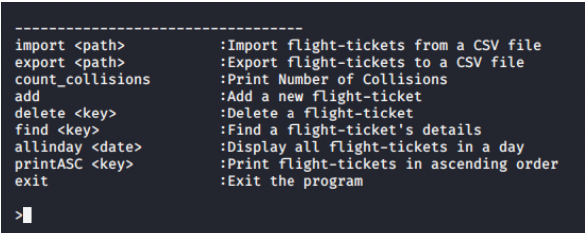
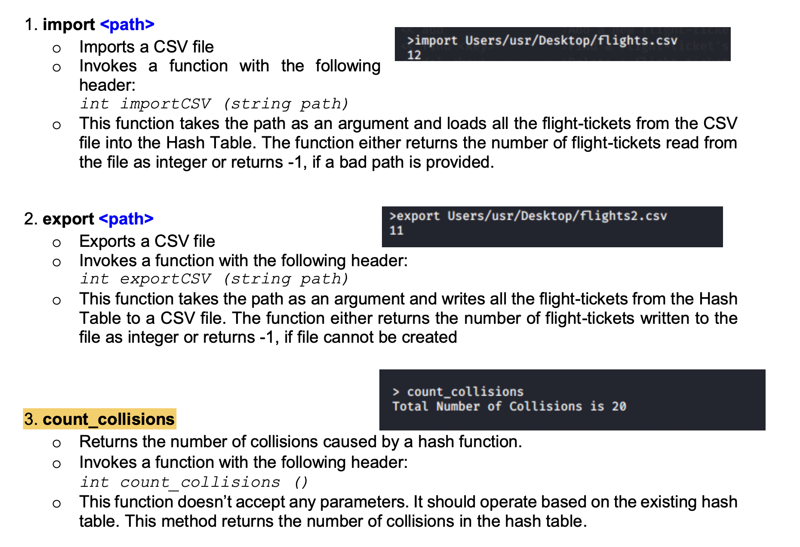
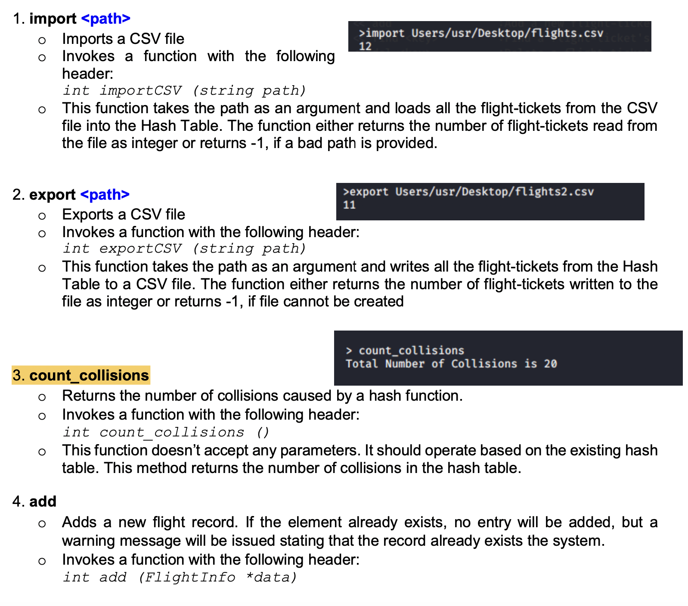
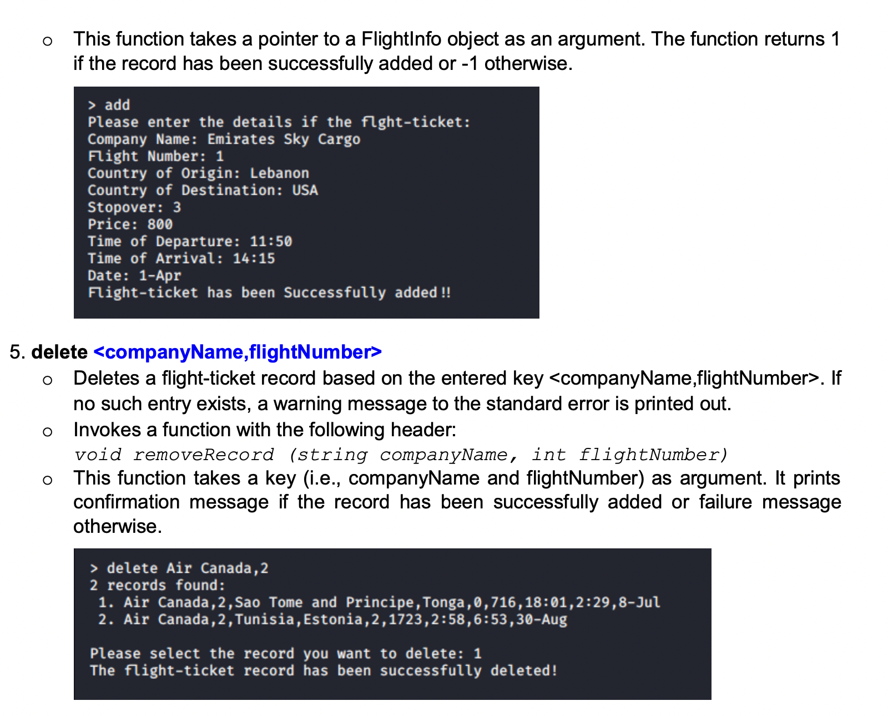
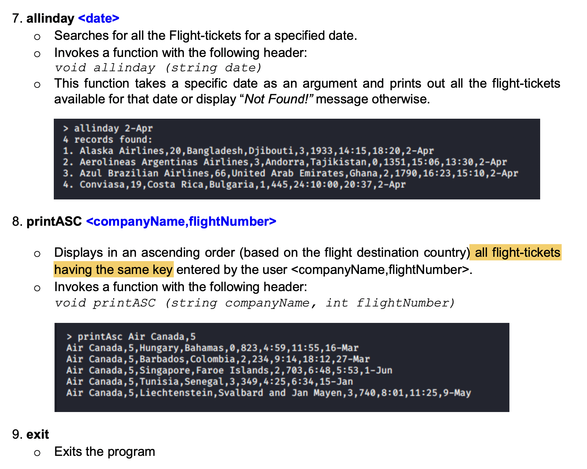

# Flight-Ticket-Management-System
Flight-Ticket Management application that can help you search for a ticket that suits you. The identification of a flight-ticket will be based on the key produced by the combination of the company name and flight number. Information of flight-tickets is to be inserted/read from either the interface of your application or from an input text file. The application supports deletion of a ticket record in addition to other management features that are highlighted in the following section.

Each record is provided in ASCII format and spans at most one line of text. The user interface allows a user to navigate and perform all the tasks/features listed in the following section. I created a program utilizing the object-oriented programming (OOP) principles and appropriate data structures. I used Hash Table as the primary data structure to implement the application and separate chaining to handle collisions.

CSV File Format:
The flight-ticket record consists of the following fields:
companyName, flightNumber, country_of_origin, country_of_destination, stopover, price, time_of_departure, time_of_arrival, date
Ex.: Emirates Sky Cargo,1,Lebanon,USA,3,800,11:50,14:15,1-Apr

##User Interface:
Through its prompt, the program is expected to accept several commands that we outline next; these commands accept as operand a string that provides a flight-ticket’s data, or the combination of companyName and flightNumber used as the key to look up records.
The application interacts with the user using a command line (terminal based) interface as shown below:

  
  
  
  
  
  
  
  
  
